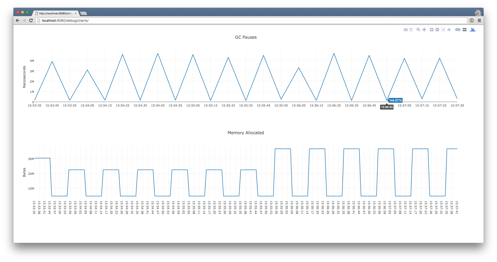

debugcharts [](https://travis-ci.org/mkevac/debugcharts)
===========

Go memory debug charts.

This package uses [Plotly](https://github.com/plotly/plotly.js) chart library. It is open source and free for use.

Installation
------------
`go get -v -u github.com/mkevac/debugcharts`

Usage
-----
Just install package and start http server. There is an example program [here](https://github.com/mkevac/debugcharts/blob/master/example/example.go).

Then go to `http://localhost:8080/debug/charts`. You should see something like this:


Data is updated every second. We keep data for last day.

User https://github.com/dgryski/ proposed interesing way for turning debugcharts on/off for your project:

You can add tagged file like this in your code 
```
// +build debugcharts

package main

import _ "github.com/mkevac/debugcharts"
```
If you want to use debugcharts, then build your project with `-tags debugcharts`
